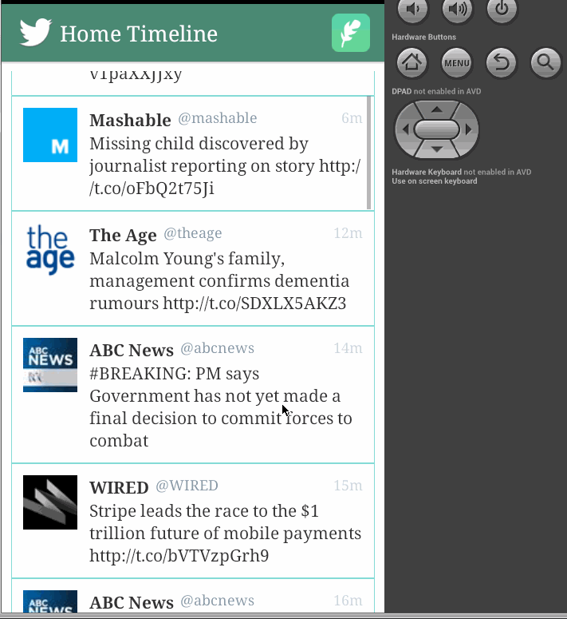

 (Revised) Simple Twitter Client - android app
================
Simple Twitter Client is a basic android app that allows a user to view home and mentions timelines, view user profiles with user timelines, as well as compose and post a new tweet. The app utilizes [Twitter REST API] (https://dev.twitter.com/rest/public). 

The following **required** functionality is completed:
* [x]	User can **sign in to Twitter** using pOAuth login. Existing Twitter account credentials are required.
* [x]	User can **view tweets from their home timeline**. Each tweet has username, screen name, profile picture, body and relative timestamp displayed.
* [x]	User can **scroll down to see more older tweets**. Number of tweets is unlimited. However there are [Twiiter Api Rate Limits] (https://dev.twitter.com/rest/public/rate-limiting) in place.
* [x]	User can **compose and post a new tweet**. Compose icon is in the right corner of action bar. Posting empty tweet is not allowed. Once button “Tweet” is clicked the tweet is posted to twitter and is inserted to the top of the timeline stream. Please note that this implementation can result in losing some tweets (tweets that were created between the last post on your timeline and new tweet posted by you).
* [x]	User can **switch tabs and view mentions timeline**. User can load more older tweets on scrolling down as well as refresh mentions timeline.
* [x]	User can **view own profile** by clicking on profile icon on action bar. Profile includes picture, banner, tagline, # of followers, # of following, and tweets on their profile. User timeline can be refreshed or older tweets loaded.
* [x]	User can **view another user profile** by clicking on image within a tweet. Profile includes picture, banner, tagline, # of followers, # of following, and tweets on user’s profile (user timeline). User timeline can be refreshed or older tweets loaded.

The following **optional** features are implemented:
* [x]	User can **open the twitter app offline and see last loaded tweets ( home and user timelines) as well as user profiles**. Persisted in SQLite tweets are refreshed on every application launch. While “live data” is displayed when app can get it from Twitter API, it is also saved for use in offline mode.
* [x]	User can **pull down to refresh tweets timelines**
* [x]	Compose tweet functionality is build using modal overlay.
* [x]	User can **see a counter with total number of characters left for tweet** on compose tweet page.
* [x]	User can **open a detailed tweet view**
* [x]	User can **click a link within a tweet body** on tweet details view. The click will launch the web browser with relevant page opened.
* [x]	Improved **error handing with relevant messaging** and logging on internet not available and error response from API.
* [x]	Improved **look and fill and user experience** (opening/hiding soft keyboard, loading spinner, focus, empty new tweet validation etc)
* [x]	**Tabs are implemented in a gingerbread-compatible approach**.

The app was tested on HTC One (Android 4.1.2) and on AVDs.

Walkthrough of implemented user stories:

GIF created with [LiceCap](http://www.cockos.com/licecap/).

The following open-source libraries were used for the project:
-	[scribe-java ] (https://github.com/fernandezpablo85/scribe-java) - Simple OAuth library for handling the authentication flow.
-	[Android Async HTTP] (https://github.com/loopj/android-async-http) - Simple asynchronous HTTP requests with JSON parsing
-	[codepath-oauth] (https://github.com/thecodepath/android-oauth-handler) - Custom-built library for managing OAuth authentication and signing of requests
-	[UniversalImageLoader] (https://github.com/nostra13/Android-Universal-Image-Loader) - Used for async image loading and caching them in memory and on disk.
-	[ActiveAndroid ] (https://github.com/pardom/ActiveAndroid) - Simple ORM for persisting a local SQLite database on the Android device

Points to consider for future development:
-	Make more tweet data available such as media 
-	Make more actions available on native Tweeter e.g. compose tweet to respond to a tweet, re-tweet, delete tweet etc. e.g. User can "reply" to any tweet on their home timeline. The user that wrote the original tweet is automatically "@" replied in compose
-	User can search for tweets matching a particular query and see results
-	User can view their direct messages (or send new ones)
-	User can view following / followers list through the profile
-	Refactor persistence-related code

